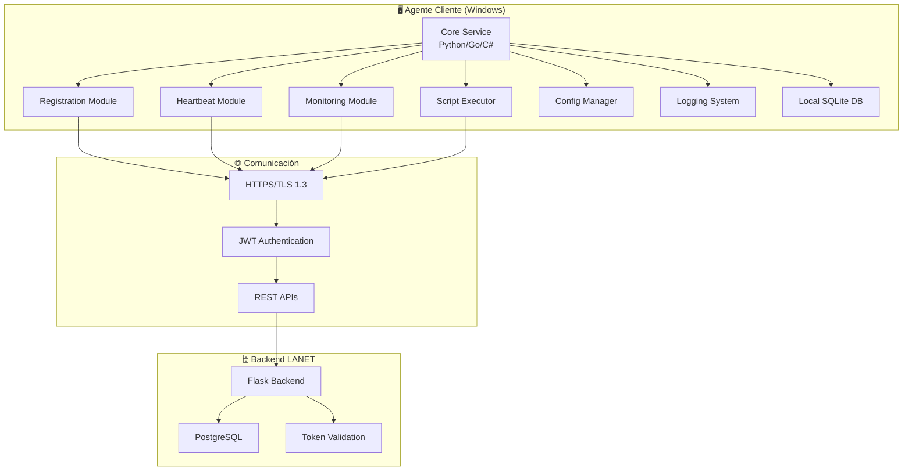
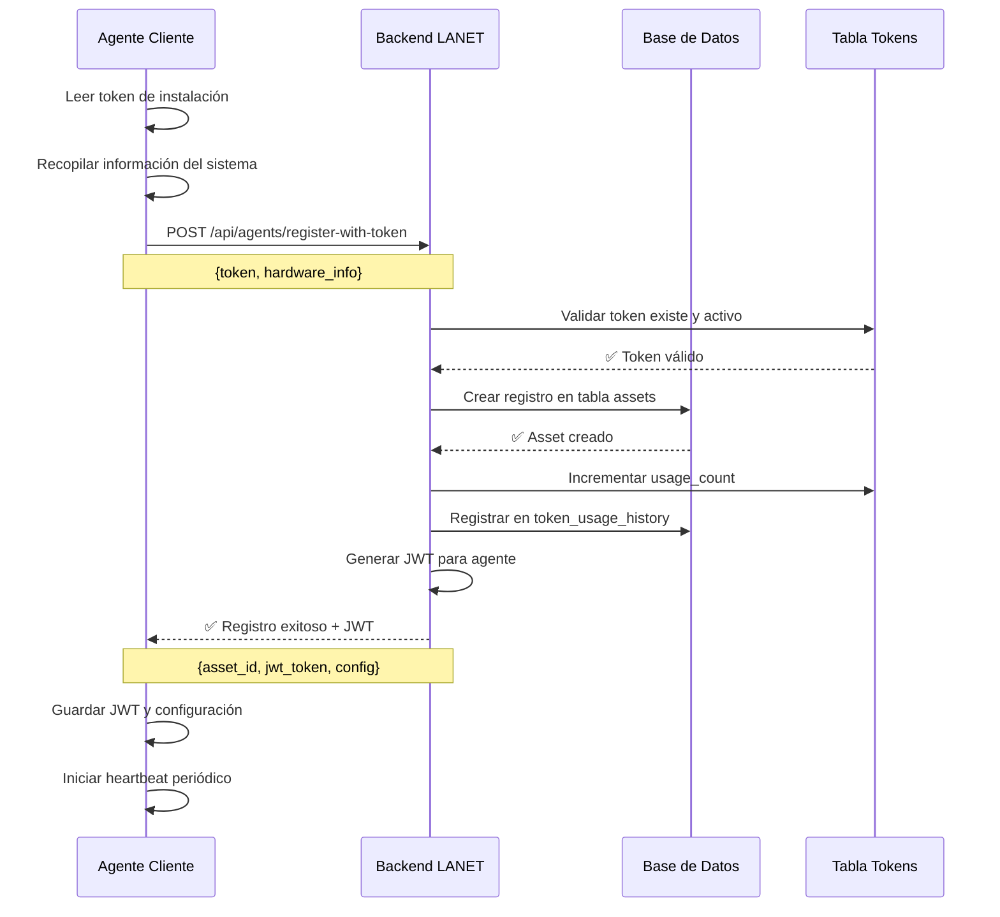

# 🖥️ **ESPECIFICACIONES DEL AGENTE CLIENTE - MÓDULO ASSET AGENTS**

## **🎯 RESUMEN EJECUTIVO**

El agente cliente es un servicio que se instala en equipos Windows de los clientes MSP para recopilar información del sistema, monitorear estado, y comunicarse con el backend de LANET Helpdesk V3. Los datos recopilados alimentan el **Portal de Activos para Clientes**, permitiendo que los clientes vean sus equipos, inventarios y métricas en tiempo real. Este documento define las especificaciones técnicas completas para su desarrollo.

---

## **🏗️ ARQUITECTURA DEL AGENTE**

### **📊 Diagrama de Componentes**



### **🔧 Componentes Principales**

| **Componente** | **Responsabilidad** | **Tecnología** |
|----------------|-------------------|----------------|
| **Core Service** | Orquestación general, lifecycle management | Python/Go/C# |
| **Registration Module** | Registro inicial con token, obtención de JWT | HTTP Client |
| **Heartbeat Module** | Comunicación periódica con backend | Scheduler + HTTP |
| **Monitoring Module** | Recolección de métricas del sistema | WMI/PowerShell |
| **Script Executor** | Ejecución de comandos remotos | PowerShell/CMD |
| **🆕 System Tray UI** | Interfaz de usuario en bandeja del sistema | pystray + tkinter |
| **🆕 Ticket Creator** | Creación de tickets desde el agente | HTTP Client + UI |
| **Config Manager** | Gestión de configuración local | JSON/YAML |
| **Logging System** | Logs locales y envío al backend | File + HTTP |
| **Local Database** | Cache de datos y configuración | SQLite |

---

## **🔑 PROCESO DE REGISTRO CON TOKEN**

### **📋 Flujo de Registro Inicial**



### **🔐 Validación de Token**

**Formato Esperado:** `LANET-{CLIENT_CODE}-{SITE_CODE}-{RANDOM}`

**Ejemplo:** `LANET-550E-660E-AEB0F9`

**Validación en Backend:**
```python
def validate_token_format(token: str) -> bool:
    pattern = r'^LANET-[A-Z0-9]{4}-[A-Z0-9]{4}-[A-Z0-9]{6}$'
    return re.match(pattern, token) is not None
```

**Estados de Token:**
- ✅ **Válido:** Token existe, activo, no expirado
- ❌ **Inválido:** Token no existe en base de datos
- ❌ **Inactivo:** Token desactivado por administrador
- ❌ **Expirado:** Token pasó fecha de expiración
- ❌ **Usado:** Token ya fue usado (si se implementa límite de uso único)

---

## **📡 APIs DISPONIBLES PARA EL AGENTE**

### **🔧 Endpoint: Registro de Agente**

```http
POST /api/agents/register-with-token
Content-Type: application/json
```

**Request Body:**
```json
{
  "token": "LANET-550E-660E-AEB0F9",
  "hardware_info": {
    "computer_name": "DESKTOP-001",
    "os": "Windows 11 Pro",
    "os_version": "22H2",
    "cpu": "Intel i7-12700K",
    "cpu_cores": 8,
    "cpu_threads": 16,
    "ram": "32GB DDR4",
    "disk": "1TB NVMe SSD",
    "mac_address": "00:11:22:33:44:55",
    "ip_address": "192.168.1.100",
    "domain": "WORKGROUP",
    "serial_number": "ABC123",
    "motherboard": "ASUS Z690-P",
    "bios_version": "v2.1",
    "assigned_user": "Juan Pérez",
    "department": "Contabilidad",
    "estimated_value": 2500,
    "warranty_expires": "2026-03-15T00:00:00Z",
    "installed_software": [
      {"name": "Microsoft Office", "version": "365", "publisher": "Microsoft"},
      {"name": "Google Chrome", "version": "120.0.6099.109", "publisher": "Google"}
    ],
    "services": [
      {"name": "Windows Update", "status": "running", "startup": "automatic"},
      {"name": "Windows Defender", "status": "running", "startup": "automatic"}
    ]
  }
}
```

**Response (201 Created):**
```json
{
  "success": true,
  "data": {
    "asset_id": "456e7890-e89b-12d3-a456-426614174000",
    "client_id": "550e8400-e29b-41d4-a716-446655440001",
    "site_id": "660e8400-e29b-41d4-a716-446655440001",
    "agent_token": "eyJhbGciOiJIUzI1NiIsInR5cCI6IkpXVCJ9...",
    "config": {
      "heartbeat_interval": 60,
      "monitoring_enabled": true,
      "auto_ticket_creation": false,
      "allowed_scripts": ["powershell", "batch"],
      "update_schedule": "02:00",
      "log_level": "INFO",
      "backend_url": "https://helpdesk.lanet.mx/api"
    },
    "registered_at": "2025-07-15T21:00:00Z"
  }
}
```

### **💓 Endpoint: Heartbeat**

```http
POST /api/agents/heartbeat
Authorization: Bearer {agent_jwt_token}
Content-Type: application/json
```

**Request Body:**
```json
{
  "asset_id": "456e7890-e89b-12d3-a456-426614174000",
  "status": {
    "cpu_usage": 15.5,
    "memory_usage": 45.2,
    "disk_usage": 85.0,
    "network_usage": 2.3,
    "uptime": 86400,
    "last_boot": "2025-07-14T21:00:00Z",
    "services_status": [
      {"name": "Windows Update", "status": "running"},
      {"name": "Windows Defender", "status": "running"}
    ]
  },
  "alerts": [
    {
      "type": "disk_space",
      "severity": "warning",
      "message": "Disk C: is 85% full",
      "threshold": 80,
      "current_value": 85.0
    }
  ],
  "logs": [
    {
      "timestamp": "2025-07-15T21:04:30Z",
      "level": "INFO",
      "message": "System monitoring completed successfully"
    }
  ]
}
```

**Response (200 OK):**
```json
{
  "success": true,
  "data": {
    "received_at": "2025-07-15T21:05:00Z",
    "next_heartbeat": "2025-07-15T21:06:00Z",
    "commands": [
      {
        "command_id": "cmd-123",
        "type": "script",
        "script": "Get-Service | Where-Object {$_.Status -eq 'Stopped'}",
        "timeout": 30,
        "priority": "normal"
      }
    ],
    "config_updates": {
      "heartbeat_interval": 30,
      "log_level": "DEBUG"
    }
  }
}
```

---

## **📊 ESTRUCTURA DE DATOS ESPERADA**

### **🖥️ Hardware Information**

```json
{
  "computer_name": "string",           // Nombre del equipo
  "os": "string",                      // Sistema operativo
  "os_version": "string",              // Versión del OS
  "cpu": "string",                     // Modelo del procesador
  "cpu_cores": "integer",              // Número de núcleos
  "cpu_threads": "integer",            // Número de hilos
  "ram": "string",                     // Memoria RAM total
  "disk": "string",                    // Información de discos
  "mac_address": "string",             // Dirección MAC principal
  "ip_address": "string",              // Dirección IP actual
  "domain": "string",                  // Dominio o workgroup
  "motherboard": "string",             // Modelo de motherboard
  "bios_version": "string",            // Versión del BIOS
  "serial_number": "string"            // Número de serie del equipo
}
```

### **💿 Software Information**

```json
{
  "installed_software": [
    {
      "name": "string",                // Nombre del programa
      "version": "string",             // Versión
      "publisher": "string",           // Editor/Fabricante
      "install_date": "string",        // Fecha de instalación
      "size": "string"                 // Tamaño en disco
    }
  ],
  "services": [
    {
      "name": "string",                // Nombre del servicio
      "status": "string",              // running, stopped, paused
      "startup": "string",             // automatic, manual, disabled
      "description": "string"          // Descripción del servicio
    }
  ],
  "updates": {
    "last_check": "timestamp",         // Última verificación de updates
    "pending_count": "integer",        // Actualizaciones pendientes
    "last_install": "timestamp",       // Última instalación
    "auto_update_enabled": "boolean"   // Auto-update activado
  }
}
```

### **📈 System Metrics**

```json
{
  "cpu_usage": "float",               // Porcentaje de uso de CPU
  "memory_usage": "float",            // Porcentaje de uso de RAM
  "disk_usage": "float",              // Porcentaje de uso de disco
  "network_usage": "float",           // Mbps de uso de red
  "uptime": "integer",                // Tiempo encendido en segundos
  "last_boot": "timestamp",           // Última vez que se reinició
  "temperature": "float",             // Temperatura del CPU (si disponible)
  "processes_count": "integer",       // Número de procesos activos
  "threads_count": "integer"          // Número de hilos activos
}
```

---

## **⚙️ CONFIGURACIÓN DEL AGENTE**

### **📋 Archivo de Configuración (agent_config.json)**

```json
{
  "agent": {
    "version": "1.0.0",
    "asset_id": "456e7890-e89b-12d3-a456-426614174000",
    "client_id": "550e8400-e29b-41d4-a716-446655440001",
    "site_id": "660e8400-e29b-41d4-a716-446655440001"
  },
  "backend": {
    "url": "https://helpdesk.lanet.mx/api",
    "timeout": 30,
    "retry_attempts": 3,
    "retry_delay": 5
  },
  "heartbeat": {
    "interval": 60,
    "enabled": true,
    "include_metrics": true,
    "include_logs": true
  },
  "monitoring": {
    "enabled": true,
    "cpu_threshold": 90,
    "memory_threshold": 90,
    "disk_threshold": 85,
    "service_monitoring": true,
    "process_monitoring": false
  },
  "scripts": {
    "enabled": true,
    "allowed_types": ["powershell", "batch"],
    "timeout": 300,
    "max_concurrent": 3
  },
  "logging": {
    "level": "INFO",
    "file_path": "C:\\ProgramData\\LANETAgent\\logs\\agent.log",
    "max_size": "10MB",
    "backup_count": 5,
    "send_to_backend": true
  },
  "security": {
    "verify_ssl": true,
    "jwt_refresh_threshold": 3600,
    "encryption_enabled": true
  }
}
```

### **🔧 Configuración Dinámica desde Backend**

El backend puede enviar actualizaciones de configuración durante el heartbeat:

```json
{
  "config_updates": {
    "heartbeat_interval": 30,          // Cambiar frecuencia de heartbeat
    "log_level": "DEBUG",              // Cambiar nivel de logging
    "monitoring_enabled": false,       // Desactivar monitoreo
    "cpu_threshold": 95,               // Cambiar umbral de CPU
    "auto_ticket_creation": true       // Activar creación automática de tickets
  }
}
```

---

## **🔐 AUTENTICACIÓN Y SEGURIDAD**

### **🎫 JWT Token Structure para Agente**

```json
{
  "asset_id": "456e7890-e89b-12d3-a456-426614174000",
  "client_id": "550e8400-e29b-41d4-a716-446655440001",
  "site_id": "660e8400-e29b-41d4-a716-446655440001",
  "computer_name": "DESKTOP-001",
  "type": "agent",
  "exp": 1721073600,                  // Expiración (24 horas)
  "iat": 1721070000                   // Issued at
}
```

### **🔒 Medidas de Seguridad**

1. **Comunicación Encriptada:** Todas las comunicaciones via HTTPS/TLS 1.3
2. **Validación de Certificados:** Verificar certificados SSL del backend
3. **JWT Refresh:** Renovar tokens antes de expiración
4. **Rate Limiting:** Respetar límites de API calls
5. **Local Encryption:** Encriptar datos sensibles en disco
6. **Audit Trail:** Registrar todas las acciones del agente

---

## **📋 REQUERIMIENTOS TÉCNICOS**

### **🖥️ Requisitos del Sistema**

| **Componente** | **Mínimo** | **Recomendado** |
|----------------|------------|-----------------|
| **OS** | Windows 10 | Windows 11 |
| **RAM** | 512 MB | 1 GB |
| **Disco** | 100 MB | 500 MB |
| **CPU** | 1 GHz | 2 GHz |
| **Red** | 1 Mbps | 10 Mbps |
| **.NET Framework** | 4.7.2 | 4.8 |
| **PowerShell** | 5.1 | 7.0+ |

### **🔧 Dependencias de Software**

```json
{
  "python_dependencies": [
    "requests>=2.28.0",
    "psutil>=5.9.0",
    "schedule>=1.2.0",
    "cryptography>=3.4.8",
    "pywin32>=304",
    "wmi>=1.5.1"
  ],
  "system_dependencies": [
    "Windows Management Instrumentation (WMI)",
    "PowerShell 5.1+",
    "Windows Event Log API",
    "Performance Counters API"
  ]
}
```

### **📦 Estructura de Instalación**

```
C:\Program Files\LANET Agent\
├── bin\
│   ├── agent.exe                    # Ejecutable principal
│   ├── agent-service.exe            # Servicio de Windows
│   └── uninstall.exe               # Desinstalador
├── config\
│   ├── agent_config.json           # Configuración principal
│   └── token.txt                   # Token de instalación
├── logs\
│   ├── agent.log                   # Logs principales
│   ├── heartbeat.log               # Logs de heartbeat
│   └── scripts.log                 # Logs de ejecución de scripts
├── data\
│   ├── agent.db                    # Base de datos SQLite local
│   └── cache\                      # Cache de datos
└── scripts\
    ├── system_info.ps1             # Scripts de recolección
    └── health_check.ps1            # Scripts de verificación
```

---

## **🚀 PLAN DE IMPLEMENTACIÓN**

### **📅 Fases de Desarrollo**

#### **Fase 1: Core y Registro (2-3 semanas)**
- ✅ Estructura base del agente
- ✅ Módulo de registro con tokens
- ✅ Comunicación básica con backend
- ✅ Configuración local
- ✅ Logging básico

#### **Fase 2: Monitoreo y Heartbeat (1-2 semanas)**
- ✅ Recolección de métricas del sistema
- ✅ Heartbeat periódico
- ✅ Detección de alertas básicas
- ✅ Envío de logs al backend

#### **Fase 3: Ejecución de Scripts (1-2 semanas)**
- ✅ Módulo de ejecución de PowerShell
- ✅ Sistema de comandos remotos
- ✅ Timeout y control de procesos
- ✅ Logs de ejecución

#### **Fase 4: Funcionalidades Avanzadas (2-3 semanas)**
- ✅ Auto-actualización del agente
- ✅ Gestión de actualizaciones Windows
- ✅ Integración con RustDesk
- ✅ Monitoreo predictivo

#### **Fase 5: Testing y Deployment (1-2 semanas)**
- ✅ Testing exhaustivo
- ✅ Instalador MSI
- ✅ Documentación de usuario
- ✅ Deployment en producción

---

## **🖱️ INTERFAZ DE USUARIO: SYSTEM TRAY**

### **📋 Menú Contextual del Agente**

El agente incluye un **icono en la bandeja del sistema** (system tray) que permite a los usuarios finales interactuar fácilmente con el sistema de helpdesk.

```
🖥️ LANET Agent (Icono en System Tray)
├─ 🟢 Estado: Online - Cafe Mexico CDMX
├─ 📊 Ver Estado del Equipo
├─ 🎫 Reportar Problema ← FUNCIONALIDAD PRINCIPAL
├─ 📋 Mis Tickets (2 abiertos)
├─ ⚙️ Configuración
└─ ❌ Salir
```

### **🎫 Ventana "Reportar Problema"**

```
┌─ Reportar Problema - LANET Helpdesk ─────────────────┐
│                                                      │
│ 📝 Describe el problema:                             │
│ ┌──────────────────────────────────────────────────┐ │
│ │ Mi computadora está muy lenta desde esta mañana  │ │
│ │ y se congela cuando abro Excel...                │ │
│ └──────────────────────────────────────────────────┘ │
│                                                      │
│ 🔧 Categoría: [Hardware ▼]                          │
│ ⚡ Prioridad: [Media ▼]                              │
│                                                      │
│ ✅ Incluir información técnica automática            │
│ ✅ Incluir captura de pantalla                       │
│                                                      │
│ 📊 Información que se enviará automáticamente:       │
│ • Equipo: DESKTOP-001 (Juan Pérez)                  │
│ • Cliente: Cafe Mexico S.A. de C.V.                 │
│ • Sitio: Oficina Principal CDMX                     │
│ • CPU: 85% | RAM: 92% | Disco: 78%                  │
│ • IP: 192.168.1.100                                 │
│ • Última actualización: hace 2 minutos              │
│                                                      │
│                           [🎫 Crear Ticket]         │
│                                                      │
└──────────────────────────────────────────────────────┘
```

### **📋 Ventana "Mis Tickets"**

```
┌─ Mis Tickets - LANET Helpdesk ───────────────────────┐
│                                                      │
│ 🔍 [Buscar tickets...                    ] [🔄]     │
│                                                      │
│ 🟡 TKT-000456 - Computadora lenta                   │
│    Creado: Hoy 14:30 | Estado: En progreso         │
│    Técnico: María González                          │
│    Canal: 🖥️ Agente                                 │
│    [👁️ Ver] [💬 Comentar]                          │
│                                                      │
│ 🟢 TKT-000445 - Problema con impresora              │
│    Creado: Ayer 09:15 | Estado: Resuelto           │
│    Técnico: Carlos Ruiz                             │
│    Canal: 🌐 Portal                                 │
│    [👁️ Ver] [⭐ Calificar]                          │
│                                                      │
│ 🔴 TKT-000432 - No puedo acceder al servidor        │
│    Creado: 10/07/2025 | Estado: Cerrado            │
│    Técnico: Ana López                               │
│    Canal: 📧 Email                                  │
│    [👁️ Ver] [📋 Historial]                         │
│                                                      │
│                              [🎫 Nuevo Ticket]      │
│                                                      │
└──────────────────────────────────────────────────────┘
```

### **🔧 Implementación Técnica del System Tray**

#### **Dependencias Adicionales:**
```python
# requirements.txt (agregar)
pystray>=0.19.4           # System tray icon
Pillow>=9.0.0             # Image handling
tkinter                   # GUI (incluido en Python)
plyer>=2.1                # Notificaciones del sistema
```

#### **Estructura de Archivos UI:**
```
src/ui/
├── system_tray.py        # Icono y menú en system tray
├── ticket_window.py      # Ventana de creación de tickets
├── status_window.py      # Ventana de estado del equipo
├── tickets_list.py       # Ventana de lista de tickets
└── assets/
    ├── lanet_icon.ico    # Icono del agente
    ├── online.ico        # Estado online
    ├── warning.ico       # Estado warning
    └── offline.ico       # Estado offline
```

#### **Flujo de Creación de Tickets:**
```python
# Ejemplo de implementación
class TicketCreator:
    def create_ticket_from_agent(self, description, category, priority):
        ticket_data = {
            "description": description,
            "category": category,
            "priority": priority,
            "channel": "agente",  # ← NUEVO CANAL
            "auto_info": self.get_system_info(),
            "asset_id": self.agent.asset_id,
            "client_id": self.agent.client_id,
            "site_id": self.agent.site_id,
            "created_by_agent": True
        }

        response = self.api_client.post("/api/tickets/create-from-agent", ticket_data)
        return response
```

---

**Última actualización**: 15/07/2025
**Versión**: 1.1
**Estado**: ✅ Especificaciones Completas + System Tray
