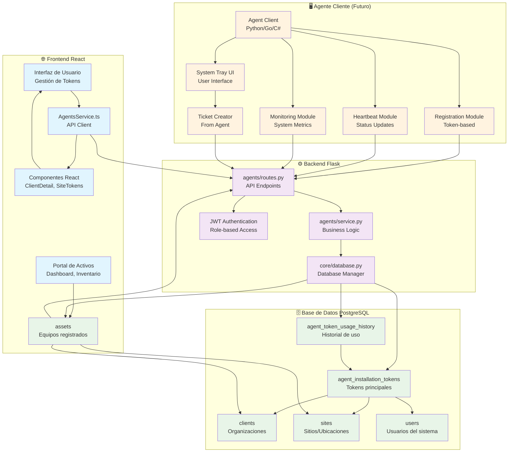
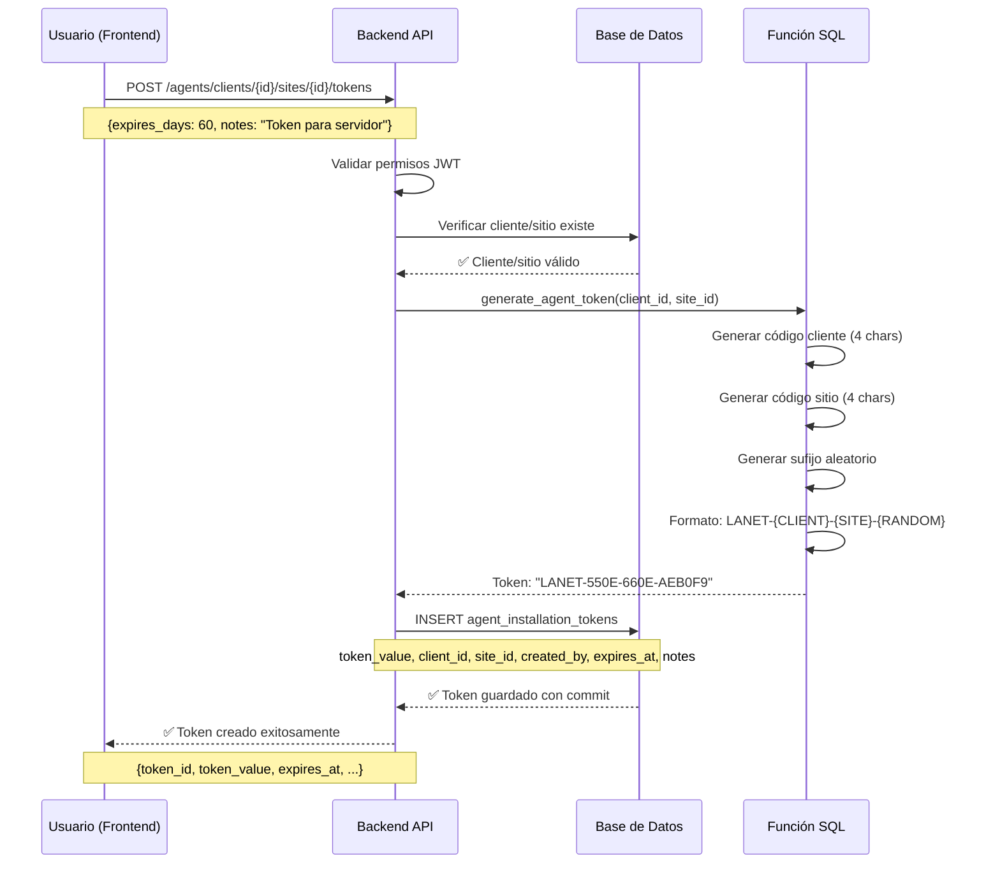
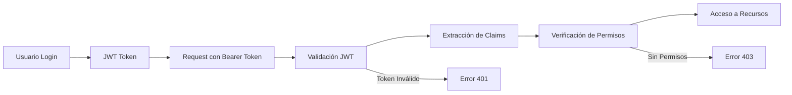

# 🏗️ **ARQUITECTURA TÉCNICA - MÓDULO ASSET AGENTS**

## **📊 DIAGRAMA DE FLUJO PRINCIPAL**



## **🔄 FLUJO DE CREACIÓN DE TOKENS**



## **🏛️ ARQUITECTURA DE CAPAS**

### **📱 Capa de Presentación (Frontend)**
```typescript
// Estructura de componentes
src/
├── components/
│   └── clients/
│       ├── ClientDetail.tsx          // Página principal del cliente
│       └── SiteTokenManagement.tsx   // Gestión de tokens por sitio
├── services/
│   └── agentsService.ts              // API client para agentes
└── types/
    └── agents.ts                     // Interfaces TypeScript
```

**Responsabilidades:**
- Renderizado de interfaz de usuario
- Gestión de estado local (React hooks)
- Comunicación con APIs backend
- Validación de formularios
- Manejo de errores de usuario

### **⚙️ Capa de Lógica de Negocio (Backend)**
```python
# Estructura del módulo
backend/modules/agents/
├── __init__.py
├── routes.py                         # Endpoints de API
├── service.py                        # Lógica de negocio
└── models.py                         # Modelos de datos (futuro)
```

**Responsabilidades:**
- Validación de datos de entrada
- Lógica de negocio para tokens
- Autenticación y autorización
- Comunicación con base de datos
- Logging y monitoreo

### **🗄️ Capa de Datos (PostgreSQL)**
```sql
-- Estructura de tablas principales
agent_installation_tokens              -- Tokens de instalación
├── token_id (PK)
├── client_id (FK → clients)
├── site_id (FK → sites)
├── token_value (UNIQUE)
├── created_by (FK → users)
└── metadata (expires_at, notes, etc.)

agent_token_usage_history              -- Historial de uso
├── usage_id (PK)
├── token_id (FK → agent_installation_tokens)
├── used_at, ip_address, user_agent
└── registration_data (hardware_info, etc.)
```

**Responsabilidades:**
- Almacenamiento persistente
- Integridad referencial
- Políticas de seguridad (RLS)
- Funciones SQL especializadas
- Índices para rendimiento

## **🔐 ARQUITECTURA DE SEGURIDAD**

### **🛡️ Políticas RLS (Row Level Security)**

```sql
-- Política de SELECT: Acceso basado en rol
CREATE POLICY agent_tokens_select_policy ON agent_installation_tokens
    FOR SELECT USING (
        -- Superadmin/technician: acceso total
        (current_user_role() = ANY (ARRAY['superadmin'::user_role, 'technician'::user_role]))
        OR
        -- Client admin: solo su organización
        (current_user_role() = 'client_admin'::user_role AND client_id = current_user_client_id())
    );

-- Política de INSERT: Solo roles autorizados
CREATE POLICY agent_tokens_insert_policy ON agent_installation_tokens
    FOR INSERT WITH CHECK (
        current_user_role() = ANY (ARRAY['superadmin'::user_role, 'technician'::user_role])
        AND created_by = current_user_id()
    );
```

### **🔑 Flujo de Autenticación**



## **📈 ESCALABILIDAD Y RENDIMIENTO**

### **🚀 Índices de Base de Datos**
```sql
-- Índices para optimización de consultas
CREATE INDEX idx_agent_tokens_client_site ON agent_installation_tokens(client_id, site_id);
CREATE INDEX idx_agent_tokens_token_value ON agent_installation_tokens(token_value);
CREATE INDEX idx_agent_tokens_active ON agent_installation_tokens(is_active) WHERE is_active = true;
CREATE INDEX idx_agent_tokens_expires_at ON agent_installation_tokens(expires_at) WHERE expires_at IS NOT NULL;
```

### **⚡ Optimizaciones Implementadas**
- **Consultas optimizadas** con índices específicos
- **Paginación** en endpoints de listado
- **Lazy loading** en frontend
- **Connection pooling** en base de datos
- **Caching** de consultas frecuentes (futuro)

## **🔄 PATRONES DE DISEÑO UTILIZADOS**

### **🏭 Repository Pattern**
```python
class AgentsService:
    def __init__(self, db_manager):
        self.db = db_manager
    
    def create_installation_token(self, ...):
        # Lógica de negocio separada de acceso a datos
        pass
```

### **🎯 Service Layer Pattern**
```typescript
class AgentsService {
    async createToken(clientId: string, siteId: string, data: CreateTokenData) {
        // Abstracción de llamadas API
        return await apiService.post(`/agents/clients/${clientId}/sites/${siteId}/tokens`, data);
    }
}
```

### **🛡️ Decorator Pattern (Autenticación)**
```python
@agents_bp.route('/tokens', methods=['POST'])
@jwt_required()  # Decorator para autenticación
def create_token():
    # Lógica del endpoint
    pass
```

## **🔮 ARQUITECTURA FUTURA (Agente Cliente)**

### **🖥️ Componentes del Agente**
```
Agent Client Architecture:
├── Core Service (Python/Go/C#)
│   ├── Registration Module
│   ├── Heartbeat Module
│   ├── Monitoring Module
│   └── Script Execution Module
├── Configuration Manager
├── Local Database (SQLite)
├── Logging System
└── Auto-updater
```

### **📡 Comunicación Agente-Backend**
```mermaid
graph LR
    A[Agente Cliente] -->|HTTPS| B[Load Balancer]
    B --> C[Backend Flask]
    C --> D[PostgreSQL]
    
    A -->|Registro Inicial| E[/api/agents/register-with-token]
    A -->|Heartbeat| F[/api/agents/heartbeat]
    A -->|Métricas| G[/api/agents/metrics]
    A -->|Logs| H[/api/agents/logs]
```

---

## **📊 MÉTRICAS Y MONITOREO**

### **📈 KPIs del Sistema**
- **Tokens activos** por cliente/sitio
- **Tasa de registro** de agentes
- **Tiempo de respuesta** de APIs
- **Errores de autenticación**
- **Uso de tokens** por período

### **🔍 Logging Strategy**
```python
# Niveles de logging implementados
self.logger.info(f"🔥 STARTING TOKEN CREATION for client {client_id}")
self.logger.error(f"Error creating token: {e}")
self.logger.debug(f"Token validation result: {result}")
```

---

**Última actualización**: 15/07/2025  
**Versión**: 1.0  
**Estado**: ✅ Implementado y Verificado
