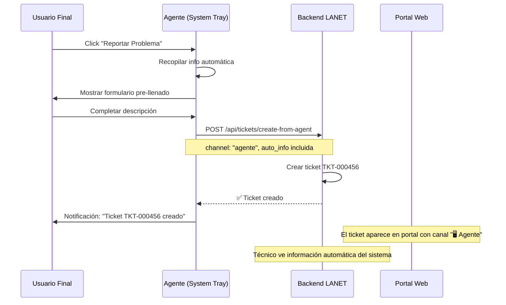

# 👥 **PORTAL DE ACTIVOS PARA CLIENTES - MÓDULO ASSET AGENTS**

## **🎯 RESUMEN EJECUTIVO**

El Portal de Activos para Clientes es una funcionalidad **CRÍTICA** que permite a los clientes MSP ver sus propios equipos, inventarios y métricas en tiempo real. Esta característica diferencia el servicio MSP y proporciona valor agregado tangible a los clientes.

### **💼 VALOR PARA EL NEGOCIO MSP**

- **🎯 Transparencia:** Clientes ven el valor del servicio de monitoreo
- **💰 Justificación de costos:** Evidencia clara del trabajo realizado
- **⚡ Eficiencia operativa:** Menos tickets de consulta básica
- **🚀 Oportunidades de venta:** Identificar equipos para renovación
- **😊 Satisfacción del cliente:** Mayor confianza y transparencia

---

## **🏗️ ARQUITECTURA DE PERMISOS POR ROL**

### **👨‍💼 CLIENT_ADMIN (Administrador del Cliente)**

**Acceso:** Todos los activos de su organización (todos los sitios)

```
Menú Principal:
├─ Panel Principal
├─ Tickets (solo de su organización)
├─ 🆕 Mis Activos ← NUEVA SECCIÓN
│  ├─ 📊 Dashboard de mi Empresa
│  ├─ 📍 Por Sitio
│  ├─ 🖥️ Equipos de Escritorio
│  ├─ 💻 Laptops
│  ├─ 🖨️ Servidores
│  └─ 📋 Inventario Completo
├─ Usuarios (solo de su organización)
└─ Reportes (solo de su organización)
```

### **🙋‍♂️ SOLICITANTE (Usuario Final)**

**Acceso:** Solo activos de sitios asignados

```
Menú Principal:
├─ Panel Principal
├─ Mis Tickets
├─ 🆕 Equipos de mi Sitio ← NUEVA SECCIÓN
│  ├─ 🖥️ Equipos de mi Oficina
│  ├─ 📊 Estado General
│  ├─ 🎫 Reportar Problema (Portal)
│  └─ 🖥️ Agente LANET (System Tray)
└─ Mi Perfil
```

### **🔧 SUPERADMIN/TECHNICIAN (MSP)**

**Acceso:** Todos los activos de todos los clientes

```
Menú Principal:
├─ Panel Principal
├─ Tickets  
├─ Clientes
├─ Usuarios
├─ 🆕 Activos ← SECCIÓN COMPLETA
│  ├─ 📊 Dashboard Global (todos los clientes)
│  ├─ 🏢 Por Cliente
│  ├─ 📍 Por Sitio
│  └─ 📋 Inventarios Completos
├─ Reportes
└─ Configuración
```

---

## **🔐 POLÍTICAS DE SEGURIDAD (RLS)**

### **🛡️ Política para Tabla `assets`**

```sql
-- Política de SELECT para assets con permisos por rol
CREATE POLICY assets_select_policy ON assets
    FOR SELECT USING (
        -- Superadmin/technician: acceso total
        (current_user_role() = ANY (ARRAY['superadmin'::user_role, 'technician'::user_role]))
        OR
        -- Client admin: solo activos de su organización
        (current_user_role() = 'client_admin'::user_role AND client_id = current_user_client_id())
        OR
        -- Solicitante: solo activos de sitios asignados
        (current_user_role() = 'solicitante'::user_role AND site_id = ANY(current_user_assigned_sites()))
    );

-- Política de INSERT: Solo el sistema puede crear assets (via agente)
CREATE POLICY assets_insert_policy ON assets
    FOR INSERT WITH CHECK (true); -- Permitir inserts del sistema

-- Política de UPDATE: Solo sistema y roles autorizados
CREATE POLICY assets_update_policy ON assets
    FOR UPDATE USING (
        current_user_role() = ANY (ARRAY['superadmin'::user_role, 'technician'::user_role])
        OR current_user_role() = 'system'::user_role -- Para updates del agente
    );
```

### **🌐 Endpoints con Permisos por Rol**

```http
# Para superadmin/technician (acceso completo)
GET /api/assets                           # Todos los activos
GET /api/assets/clients/{client_id}       # Activos de un cliente específico
GET /api/assets/sites/{site_id}           # Activos de un sitio específico

# Para client_admin (solo su organización)
GET /api/assets/my-organization           # Solo activos de su organización
GET /api/assets/my-sites                  # Solo sitios de su organización
GET /api/assets/dashboard/my-org          # Dashboard de su organización

# Para solicitante (solo sitios asignados)
GET /api/assets/my-assigned-sites         # Solo activos de sitios asignados
GET /api/assets/dashboard/my-sites        # Dashboard de sitios asignados
```

---

## **📊 DISEÑO DE INTERFACES**

### **🏢 Dashboard para CLIENT_ADMIN**

```
┌─ DASHBOARD DE ACTIVOS - Cafe Mexico S.A. de C.V. ─────────────┐
│                                                                │
│ 📊 RESUMEN GENERAL                                             │
│ ┌─ Total: 15 equipos ─┐ ┌─ Online: 12 ─┐ ┌─ Alertas: 2 ─┐    │
│ │ 🖥️ Escritorio: 8   │ │ 🟢 80%       │ │ ⚠️ Disco      │    │
│ │ 💻 Laptops: 5      │ │ 🟡 Warning: 2│ │ 🔴 Offline    │    │
│ │ 🖨️ Servidores: 2   │ │ 🔴 Offline: 1│ │               │    │
│ └────────────────────┘ └──────────────┘ └───────────────┘    │
│                                                                │
│ 📍 POR SITIO                                                   │
│ ┌─ Oficina Principal CDMX ────────────────────────────────────┐│
│ │ 🖥️ 8 equipos │ 🟢 7 online │ 🟡 1 warning │ 🔴 0 offline ││
│ │ Última actualización: hace 2 minutos                       ││
│ │ [📋 Ver Inventario] [📊 Ver Métricas] [🎫 Crear Ticket]   ││
│ └─────────────────────────────────────────────────────────────┘│
│ ┌─ Sucursal Polanco ──────────────────────────────────────────┐│
│ │ 🖥️ 7 equipos │ 🟢 5 online │ 🟡 1 warning │ 🔴 1 offline ││
│ │ ⚠️ SERVER-POLANCO-01 sin conexión desde hace 2 días       ││
│ │ [📋 Ver Inventario] [📊 Ver Métricas] [🎫 Crear Ticket]   ││
│ └─────────────────────────────────────────────────────────────┘│
│                                                                │
│ 🚨 ALERTAS RECIENTES                                           │
│ • DESKTOP-HR-03: Disco C: al 92% (Oficina Principal)         │
│ • SERVER-POLANCO-01: Sin conexión (Sucursal Polanco)         │
│                                                                │
│ 📈 TENDENCIAS (ÚLTIMOS 30 DÍAS)                               │
│ • Promedio uptime: 98.5%                                      │
│ • Tickets generados: 12 (↓ 25% vs mes anterior)              │
│ • Equipos actualizados: 13/15 (87%)                          │
│                                                                │
└────────────────────────────────────────────────────────────────┘
```

### **📋 Vista de Inventario Detallado**

```
┌─ INVENTARIO COMPLETO - Oficina Principal CDMX ────────────────┐
│                                                                │
│ 🔍 Filtros: [Tipo ▼] [Estado ▼] [Buscar...        ] [🔄]     │
│                                                                │
│ 🖥️ DESKTOP-001                                                │
│ ├─ Hardware: Intel i7-12700K, 32GB RAM, 1TB SSD              │
│ ├─ Software: Windows 11 Pro, Office 365, Chrome 120          │
│ ├─ Estado: 🟢 Online (CPU: 15%, RAM: 45%, Disco: 85%)        │
│ ├─ Última actualización: hace 2 minutos                       │
│ ├─ Valor estimado: $2,500 USD                                 │
│ ├─ Garantía: Vigente hasta 15/03/2026                         │
│ └─ [📊 Ver Detalles] [🎫 Reportar Problema] [📋 Historial]   │
│                                                                │
│ 💻 LAPTOP-HR-05                                               │
│ ├─ Hardware: Intel i5-8250U, 16GB RAM, 512GB SSD             │
│ ├─ Software: Windows 10 Pro, Office 365, Teams               │
│ ├─ Estado: 🟡 Warning (Disco al 92%)                         │
│ ├─ Última actualización: hace 1 hora                          │
│ ├─ Valor estimado: $1,200 USD                                 │
│ ├─ Garantía: ⚠️ Vence en 3 meses (15/10/2025)               │
│ └─ [📊 Ver Detalles] [🎫 Reportar Problema] [📋 Historial]   │
│                                                                │
│ 🖨️ SERVER-DB-01                                               │
│ ├─ Hardware: Intel Xeon E5-2690, 64GB RAM, 2TB RAID          │
│ ├─ Software: Windows Server 2022, SQL Server 2019            │
│ ├─ Estado: 🟢 Online (CPU: 25%, RAM: 60%, Disco: 45%)        │
│ ├─ Última actualización: hace 5 minutos                       │
│ ├─ Valor estimado: $8,500 USD                                 │
│ ├─ Garantía: Vigente hasta 20/12/2026                         │
│ └─ [📊 Ver Detalles] [🎫 Reportar Problema] [📋 Historial]   │
│                                                                │
│ 📊 RESUMEN DEL INVENTARIO                                     │
│ • Valor total estimado: $47,300 USD                           │
│ • Equipos con garantía vigente: 12/15 (80%)                   │
│ • Equipos que requieren actualización: 3/15 (20%)            │
│                                                                │
│ 📄 [📥 Exportar a Excel] [📧 Enviar por Email] [🖨️ Imprimir] │
│                                                                │
└────────────────────────────────────────────────────────────────┘
```

### **📊 Vista Detallada de Equipo Individual**

```
┌─ DESKTOP-001 ─────────────────────────────────────────────────┐
│ 🟢 Online │ Última conexión: hace 2 minutos                  │
│ 📍 Cafe Mexico S.A. de C.V. → Oficina Principal CDMX        │
│ 👤 Usuario asignado: Juan Pérez (Contabilidad)               │
├─ HARDWARE ────────────────────────────────────────────────────┤
│ CPU: Intel i7-12700K (8 cores, 3.6GHz) │ RAM: 32GB DDR4     │
│ Disco: 1TB NVMe SSD (85% usado)         │ Red: Gigabit      │
│ IP: 192.168.1.100 │ MAC: 00:11:22:33:44:55 │ S/N: ABC123    │
│ Motherboard: ASUS Z690-P │ BIOS: v2.1 │ Garantía: ✅ Vigente│
├─ SOFTWARE ────────────────────────────────────────────────────┤
│ OS: Windows 11 Pro 22H2 (Build 22621)  │ Office: 365 Biz   │
│ Antivirus: Windows Defender (Activo)    │ Browser: Chrome   │
│ Último update: 10/07/2025 │ Updates pendientes: 3 (críticos)│
│ Software instalado: 47 programas │ Servicios: 156 activos   │
├─ MÉTRICAS EN TIEMPO REAL ──────────────────────────────────────┤
│ CPU: 15% ████░░░░░░ │ RAM: 45% ████████░░ │ Red: 2.3 Mbps    │
│ Disco C: 85% ████████████████░░░░ │ Temp: 42°C │ Uptime: 2d4h│
│ Procesos activos: 89 │ Hilos: 1,247 │ Handles: 28,456      │
├─ ALERTAS Y RECOMENDACIONES ───────────────────────────────────┤
│ ⚠️ Disco C: al 85% - Considerar limpieza o expansión        │
│ 🔄 3 actualizaciones críticas pendientes                     │
│ 💡 Recomendación: Programar mantenimiento preventivo         │
├─ HISTORIAL DE TICKETS ─────────────────────────────────────────┤
│ • TKT-000123 - Disco casi lleno (15/07/2025) - ✅ Resuelto  │
│ • TKT-000098 - Actualización Office (10/07/2025) - ✅ Cerrado│
│ • TKT-000087 - Lentitud general (05/07/2025) - ✅ Resuelto  │
├─ ACCIONES DISPONIBLES ────────────────────────────────────────┤
│ [🎫 Crear Ticket] [🖥️ Solicitar Acceso Remoto]              │
│ [📊 Ver Métricas Históricas] [📋 Ver Logs Detallados]       │
│ [🔄 Solicitar Reinicio] [⚙️ Solicitar Mantenimiento]        │
└───────────────────────────────────────────────────────────────┘
```

---

## **🌐 APIs REQUERIDAS PARA EL PORTAL**

### **📊 Dashboard APIs**

```http
# Dashboard resumen para client_admin
GET /api/assets/dashboard/my-organization
Response: {
  "summary": {
    "total_assets": 15,
    "online": 12,
    "warning": 2,
    "offline": 1,
    "by_type": {"desktop": 8, "laptop": 5, "server": 2}
  },
  "sites": [
    {
      "site_id": "uuid",
      "site_name": "Oficina Principal CDMX",
      "assets_count": 8,
      "online": 7,
      "warning": 1,
      "offline": 0,
      "last_update": "2025-07-15T21:05:00Z"
    }
  ],
  "recent_alerts": [
    {
      "asset_name": "DESKTOP-HR-03",
      "alert_type": "disk_space",
      "message": "Disco C: al 92%",
      "site_name": "Oficina Principal",
      "severity": "warning",
      "timestamp": "2025-07-15T20:30:00Z"
    }
  ],
  "trends": {
    "avg_uptime": 98.5,
    "tickets_generated": 12,
    "tickets_change": -25,
    "updated_assets": 13,
    "total_assets": 15
  }
}

# Dashboard para solicitante (solo sitios asignados)
GET /api/assets/dashboard/my-sites
Response: {
  "summary": {
    "total_assets": 5,
    "online": 4,
    "warning": 1,
    "offline": 0
  },
  "assets": [
    {
      "asset_id": "uuid",
      "computer_name": "DESKTOP-001",
      "status": "online",
      "cpu_usage": 15.5,
      "memory_usage": 45.2,
      "disk_usage": 85.0,
      "last_seen": "2025-07-15T21:05:00Z"
    }
  ]
}
```

### **📋 Inventario APIs**

```http
# Inventario completo para client_admin
GET /api/assets/inventory/my-organization?type=all&status=all&page=1&limit=20
Response: {
  "assets": [
    {
      "asset_id": "uuid",
      "computer_name": "DESKTOP-001",
      "type": "desktop",
      "status": "online",
      "hardware_info": {
        "cpu": "Intel i7-12700K",
        "ram": "32GB DDR4",
        "disk": "1TB NVMe SSD",
        "serial_number": "ABC123"
      },
      "software_info": {
        "os": "Windows 11 Pro",
        "os_version": "22H2",
        "installed_software": [...]
      },
      "metrics": {
        "cpu_usage": 15.5,
        "memory_usage": 45.2,
        "disk_usage": 85.0
      },
      "warranty": {
        "status": "active",
        "expires_at": "2026-03-15T00:00:00Z"
      },
      "estimated_value": 2500,
      "last_seen": "2025-07-15T21:05:00Z",
      "site_name": "Oficina Principal CDMX"
    }
  ],
  "summary": {
    "total_value": 47300,
    "warranty_active": 12,
    "warranty_total": 15,
    "needs_update": 3
  },
  "pagination": {
    "page": 1,
    "limit": 20,
    "total": 15,
    "pages": 1
  }
}

# Detalle individual de activo
GET /api/assets/{asset_id}/detail
Response: {
  "asset": {
    "asset_id": "uuid",
    "computer_name": "DESKTOP-001",
    "assigned_user": "Juan Pérez",
    "department": "Contabilidad",
    "hardware_info": {...},
    "software_info": {...},
    "current_metrics": {...},
    "warranty_info": {...},
    "alerts": [...],
    "recommendations": [...]
  },
  "ticket_history": [
    {
      "ticket_id": "TKT-000123",
      "title": "Disco casi lleno",
      "status": "resolved",
      "created_at": "2025-07-15T10:00:00Z",
      "resolved_at": "2025-07-15T14:30:00Z"
    }
  ]
}
```

### **🚨 Alertas y Métricas APIs**

```http
# Alertas activas para el cliente
GET /api/assets/alerts/my-organization
Response: {
  "alerts": [
    {
      "alert_id": "uuid",
      "asset_id": "uuid",
      "asset_name": "DESKTOP-HR-03",
      "alert_type": "disk_space",
      "severity": "warning",
      "message": "Disco C: al 92%",
      "threshold": 90,
      "current_value": 92,
      "site_name": "Oficina Principal CDMX",
      "created_at": "2025-07-15T20:30:00Z",
      "acknowledged": false
    }
  ]
}

# Métricas históricas de un activo
GET /api/assets/{asset_id}/metrics/history?period=7d
Response: {
  "metrics": [
    {
      "timestamp": "2025-07-15T21:00:00Z",
      "cpu_usage": 15.5,
      "memory_usage": 45.2,
      "disk_usage": 85.0,
      "network_usage": 2.3
    }
  ]
}
```

---

## **📈 REPORTES EJECUTIVOS PARA CLIENTES**

### **📊 Reporte Mensual Automático**

```json
{
  "report_type": "monthly_assets_summary",
  "client_name": "Cafe Mexico S.A. de C.V.",
  "period": "2025-07",
  "generated_at": "2025-08-01T09:00:00Z",
  "summary": {
    "total_assets": 15,
    "avg_uptime": 98.5,
    "incidents_resolved": 8,
    "preventive_actions": 3,
    "cost_savings": 2500
  },
  "highlights": [
    "✅ 98.5% de uptime promedio (objetivo: 95%)",
    "✅ 8 incidentes resueltos proactivamente",
    "⚠️ 3 equipos requieren actualización de hardware",
    "💡 Ahorro estimado: $2,500 USD en tiempo de inactividad evitado"
  ],
  "recommendations": [
    "Considerar actualización de LAPTOP-HR-05 (garantía vence en 3 meses)",
    "Programar limpieza de disco en DESKTOP-HR-03",
    "Evaluar migración a Windows 11 en equipos con Windows 10"
  ],
  "next_actions": [
    "Mantenimiento preventivo programado para 15/08/2025",
    "Revisión de garantías próximas a vencer",
    "Actualización de software crítico"
  ]
}
```

---

---

## **🖥️ INTEGRACIÓN CON AGENTE CLIENTE (SYSTEM TRAY)**

### **🎯 Experiencia del Usuario Final**

Los usuarios finales tendrán **DOS formas** de interactuar con el sistema de helpdesk:

#### **🌐 Portal Web (Navegador)**
- Acceso completo a dashboard de activos
- Vista detallada de inventarios
- Reportes y métricas históricas
- Gestión completa de tickets

#### **🖥️ Agente Cliente (System Tray)**
- **Icono permanente** en la bandeja del sistema
- **Creación rápida** de tickets con información automática
- **Vista de tickets** del equipo actual
- **Estado en tiempo real** del equipo
- **Canal "agente"** para identificar origen del ticket

### **🎫 Flujo de Tickets desde Agente**



### **📊 Ventajas del Canal "Agente"**

| **Aspecto** | **Portal Web** | **Agente System Tray** |
|-------------|----------------|-------------------------|
| **Acceso** | Requiere navegador | Siempre disponible |
| **Información técnica** | Manual | Automática |
| **Velocidad** | 3-5 clics | 2 clics |
| **Contexto** | Usuario debe describir | Sistema incluye métricas |
| **Identificación** | Canal "portal" | Canal "agente" |
| **Captura de pantalla** | Manual | Automática (opcional) |
| **Logs del sistema** | No disponible | Incluidos automáticamente |

---

**Última actualización**: 15/07/2025
**Versión**: 1.1
**Estado**: 📋 Especificaciones Completas + 🖥️ System Tray
