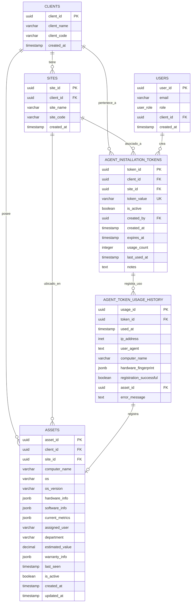

# 🗄️ **ESQUEMA DE BASE DE DATOS - MÓDULO ASSET AGENTS**

## **📊 DIAGRAMA DE RELACIONES**



---

## **🏗️ ESTRUCTURA DETALLADA DE TABLAS**

### **🎫 Tabla: `agent_installation_tokens`**

```sql
CREATE TABLE agent_installation_tokens (
    -- Identificadores
    token_id UUID PRIMARY KEY DEFAULT uuid_generate_v4(),
    client_id UUID NOT NULL REFERENCES clients(client_id) ON DELETE CASCADE,
    site_id UUID NOT NULL REFERENCES sites(site_id) ON DELETE CASCADE,
    
    -- Token y estado
    token_value VARCHAR(50) UNIQUE NOT NULL, -- Format: "LANET-{CLIENT_CODE}-{SITE_CODE}-{RANDOM}"
    is_active BOOLEAN DEFAULT true,
    
    -- Metadatos de creación
    created_by UUID NOT NULL REFERENCES users(user_id),
    created_at TIMESTAMP WITH TIME ZONE DEFAULT CURRENT_TIMESTAMP,
    
    -- Configuración de expiración
    expires_at TIMESTAMP WITH TIME ZONE, -- NULL = sin expiración
    
    -- Estadísticas de uso
    usage_count INTEGER DEFAULT 0,
    last_used_at TIMESTAMP WITH TIME ZONE,
    
    -- Información adicional
    notes TEXT -- Descripción opcional del propósito del token
);
```

**Constraints y Validaciones:**
```sql
-- Constraint para formato de token
ALTER TABLE agent_installation_tokens 
ADD CONSTRAINT chk_token_format 
CHECK (token_value ~ '^LANET-[A-Z0-9]{4}-[A-Z0-9]{4}-[A-Z0-9]{6}$');

-- Constraint para expiración futura
ALTER TABLE agent_installation_tokens 
ADD CONSTRAINT chk_expires_future 
CHECK (expires_at IS NULL OR expires_at > created_at);

-- Constraint para usage_count no negativo
ALTER TABLE agent_installation_tokens 
ADD CONSTRAINT chk_usage_count_positive 
CHECK (usage_count >= 0);
```

**Índices para Rendimiento:**
```sql
-- Índice para búsquedas por cliente/sitio
CREATE INDEX idx_agent_tokens_client_site 
ON agent_installation_tokens(client_id, site_id);

-- Índice para búsquedas por token_value (único)
CREATE UNIQUE INDEX idx_agent_tokens_token_value 
ON agent_installation_tokens(token_value);

-- Índice para tokens activos
CREATE INDEX idx_agent_tokens_active 
ON agent_installation_tokens(is_active) 
WHERE is_active = true;

-- Índice para tokens próximos a expirar
CREATE INDEX idx_agent_tokens_expires_at 
ON agent_installation_tokens(expires_at) 
WHERE expires_at IS NOT NULL;

-- Índice para búsquedas por creador
CREATE INDEX idx_agent_tokens_created_by 
ON agent_installation_tokens(created_by);
```

### **📋 Tabla: `agent_token_usage_history`**

```sql
CREATE TABLE agent_token_usage_history (
    -- Identificador único
    usage_id UUID PRIMARY KEY DEFAULT uuid_generate_v4(),
    
    -- Referencia al token usado
    token_id UUID NOT NULL REFERENCES agent_installation_tokens(token_id) ON DELETE CASCADE,
    
    -- Información temporal
    used_at TIMESTAMP WITH TIME ZONE DEFAULT CURRENT_TIMESTAMP,
    
    -- Información de conexión
    ip_address INET,
    user_agent TEXT,
    
    -- Información del equipo
    computer_name VARCHAR(255),
    hardware_fingerprint JSONB, -- Hash único del hardware
    
    -- Resultado del registro
    registration_successful BOOLEAN DEFAULT false,
    asset_id UUID REFERENCES assets(asset_id), -- NULL si falló el registro
    
    -- Información de errores
    error_message TEXT -- NULL si fue exitoso
);
```

**Índices para Auditoría:**
```sql
-- Índice para búsquedas por token
CREATE INDEX idx_token_usage_token_id 
ON agent_token_usage_history(token_id);

-- Índice para búsquedas por fecha
CREATE INDEX idx_token_usage_used_at 
ON agent_token_usage_history(used_at);

-- Índice para registros exitosos
CREATE INDEX idx_token_usage_successful 
ON agent_token_usage_history(registration_successful) 
WHERE registration_successful = true;

-- Índice para búsquedas por IP
CREATE INDEX idx_token_usage_ip_address 
ON agent_token_usage_history(ip_address);
```

### **🖥️ Tabla: `assets` (Equipos Registrados)**

```sql
CREATE TABLE assets (
    -- Identificadores
    asset_id UUID PRIMARY KEY DEFAULT uuid_generate_v4(),
    client_id UUID NOT NULL REFERENCES clients(client_id) ON DELETE CASCADE,
    site_id UUID NOT NULL REFERENCES sites(site_id) ON DELETE CASCADE,
    
    -- Información básica del equipo
    computer_name VARCHAR(255) NOT NULL,
    os VARCHAR(100),
    os_version VARCHAR(50),
    
    -- Información de hardware (JSON)
    hardware_info JSONB, -- CPU, RAM, discos, red, etc.
    
    -- Información de software (JSON)
    software_info JSONB, -- Software instalado, servicios, etc.
    
    -- Estado y conectividad
    last_seen TIMESTAMP WITH TIME ZONE DEFAULT CURRENT_TIMESTAMP,
    is_active BOOLEAN DEFAULT true,
    
    -- Metadatos
    created_at TIMESTAMP WITH TIME ZONE DEFAULT CURRENT_TIMESTAMP,
    updated_at TIMESTAMP WITH TIME ZONE DEFAULT CURRENT_TIMESTAMP
);
```

**Estructura de JSONB:**
```json
// hardware_info example
{
  "cpu": {
    "model": "Intel i7-12700K",
    "cores": 8,
    "threads": 16,
    "frequency": "3.6 GHz"
  },
  "memory": {
    "total": "32 GB",
    "available": "16 GB",
    "type": "DDR4"
  },
  "disks": [
    {
      "drive": "C:",
      "total": "1 TB",
      "free": "150 GB",
      "type": "NVMe SSD"
    }
  ],
  "network": {
    "mac_address": "00:11:22:33:44:55",
    "ip_address": "192.168.1.100",
    "adapter": "Gigabit Ethernet"
  }
}

// software_info example
{
  "installed_programs": [
    {"name": "Microsoft Office", "version": "365", "publisher": "Microsoft"},
    {"name": "Google Chrome", "version": "120.0.6099.109", "publisher": "Google"}
  ],
  "services": [
    {"name": "Windows Update", "status": "running", "startup": "automatic"},
    {"name": "Windows Defender", "status": "running", "startup": "automatic"}
  ],
  "updates": {
    "last_check": "2025-07-15T10:00:00Z",
    "pending_count": 3,
    "last_install": "2025-07-10T02:00:00Z"
  }
}
```

---

## **🔐 POLÍTICAS DE SEGURIDAD (RLS)**

### **🛡️ Políticas para `agent_installation_tokens`**

```sql
-- Habilitar RLS en la tabla
ALTER TABLE agent_installation_tokens ENABLE ROW LEVEL SECURITY;

-- Política de SELECT: Acceso basado en rol
CREATE POLICY agent_tokens_select_policy ON agent_installation_tokens
    FOR SELECT USING (
        -- Superadmin y technician: acceso total
        (current_user_role() = ANY (ARRAY['superadmin'::user_role, 'technician'::user_role]))
        OR
        -- Client admin: solo tokens de su organización
        (current_user_role() = 'client_admin'::user_role AND client_id = current_user_client_id())
    );

-- Política de INSERT: Solo roles autorizados
CREATE POLICY agent_tokens_insert_policy ON agent_installation_tokens
    FOR INSERT WITH CHECK (
        current_user_role() = ANY (ARRAY['superadmin'::user_role, 'technician'::user_role])
        AND created_by = current_user_id()
    );

-- Política de UPDATE: Solo roles autorizados
CREATE POLICY agent_tokens_update_policy ON agent_installation_tokens
    FOR UPDATE USING (
        current_user_role() = ANY (ARRAY['superadmin'::user_role, 'technician'::user_role])
    );

-- Política de DELETE: Solo superadmin
CREATE POLICY agent_tokens_delete_policy ON agent_installation_tokens
    FOR DELETE USING (
        current_user_role() = 'superadmin'::user_role
    );
```

### **🛡️ Políticas para `agent_token_usage_history`**

```sql
-- Habilitar RLS
ALTER TABLE agent_token_usage_history ENABLE ROW LEVEL SECURITY;

-- Política de SELECT: Basada en acceso a tokens
CREATE POLICY token_usage_select_policy ON agent_token_usage_history
    FOR SELECT USING (
        EXISTS (
            SELECT 1 FROM agent_installation_tokens ait
            WHERE ait.token_id = agent_token_usage_history.token_id
            -- Hereda permisos de la tabla de tokens
        )
    );

-- Política de INSERT: Solo el sistema puede insertar
CREATE POLICY token_usage_insert_policy ON agent_token_usage_history
    FOR INSERT WITH CHECK (true); -- Permitir inserts del sistema
```

---

## **⚙️ FUNCIONES SQL ESPECIALIZADAS**

### **🎲 Función: `generate_agent_token`**

```sql
CREATE OR REPLACE FUNCTION generate_agent_token(
    p_client_id UUID,
    p_site_id UUID
) RETURNS VARCHAR(50) AS $$
DECLARE
    client_code VARCHAR(4);
    site_code VARCHAR(4);
    random_suffix VARCHAR(6);
    final_token VARCHAR(50);
BEGIN
    -- Generar código del cliente (primeros 4 caracteres del nombre, uppercase)
    SELECT UPPER(LEFT(REGEXP_REPLACE(client_name, '[^A-Za-z0-9]', '', 'g'), 4))
    INTO client_code
    FROM clients 
    WHERE client_id = p_client_id;
    
    -- Generar código del sitio (primeros 4 caracteres del nombre, uppercase)
    SELECT UPPER(LEFT(REGEXP_REPLACE(site_name, '[^A-Za-z0-9]', '', 'g'), 4))
    INTO site_code
    FROM sites 
    WHERE site_id = p_site_id;
    
    -- Generar sufijo aleatorio de 6 caracteres
    SELECT UPPER(SUBSTRING(MD5(RANDOM()::TEXT || CLOCK_TIMESTAMP()::TEXT) FROM 1 FOR 6))
    INTO random_suffix;
    
    -- Construir token final
    final_token := 'LANET-' || client_code || '-' || site_code || '-' || random_suffix;
    
    RETURN final_token;
END;
$$ LANGUAGE plpgsql;
```

### **✅ Función: `validate_agent_token`**

```sql
CREATE OR REPLACE FUNCTION validate_agent_token(
    p_token_value VARCHAR(50)
) RETURNS TABLE(
    is_valid BOOLEAN,
    token_id UUID,
    client_id UUID,
    site_id UUID,
    error_message TEXT
) AS $$
BEGIN
    RETURN QUERY
    SELECT 
        CASE 
            WHEN ait.token_id IS NULL THEN false
            WHEN NOT ait.is_active THEN false
            WHEN ait.expires_at IS NOT NULL AND ait.expires_at < CURRENT_TIMESTAMP THEN false
            ELSE true
        END as is_valid,
        ait.token_id,
        ait.client_id,
        ait.site_id,
        CASE 
            WHEN ait.token_id IS NULL THEN 'Token not found'
            WHEN NOT ait.is_active THEN 'Token is inactive'
            WHEN ait.expires_at IS NOT NULL AND ait.expires_at < CURRENT_TIMESTAMP THEN 'Token has expired'
            ELSE NULL
        END as error_message
    FROM agent_installation_tokens ait
    WHERE ait.token_value = p_token_value;
    
    -- Si no se encontró ningún token, devolver resultado inválido
    IF NOT FOUND THEN
        RETURN QUERY SELECT false, NULL::UUID, NULL::UUID, NULL::UUID, 'Token not found'::TEXT;
    END IF;
END;
$$ LANGUAGE plpgsql;
```

---

## **📊 VISTAS ÚTILES PARA REPORTES**

### **📈 Vista: `v_token_summary`**

```sql
CREATE VIEW v_token_summary AS
SELECT 
    ait.token_id,
    ait.token_value,
    c.client_name,
    s.site_name,
    ait.is_active,
    ait.created_at,
    ait.expires_at,
    ait.usage_count,
    ait.last_used_at,
    u.email as created_by_email,
    CASE 
        WHEN ait.expires_at IS NOT NULL AND ait.expires_at < CURRENT_TIMESTAMP THEN 'expired'
        WHEN NOT ait.is_active THEN 'inactive'
        ELSE 'active'
    END as status
FROM agent_installation_tokens ait
JOIN clients c ON ait.client_id = c.client_id
JOIN sites s ON ait.site_id = s.site_id
JOIN users u ON ait.created_by = u.user_id;
```

### **📊 Vista: `v_token_usage_stats`**

```sql
CREATE VIEW v_token_usage_stats AS
SELECT 
    ait.token_id,
    ait.token_value,
    c.client_name,
    s.site_name,
    COUNT(uth.usage_id) as total_attempts,
    COUNT(CASE WHEN uth.registration_successful THEN 1 END) as successful_registrations,
    COUNT(CASE WHEN NOT uth.registration_successful THEN 1 END) as failed_attempts,
    MAX(uth.used_at) as last_attempt,
    MIN(uth.used_at) as first_attempt
FROM agent_installation_tokens ait
JOIN clients c ON ait.client_id = c.client_id
JOIN sites s ON ait.site_id = s.site_id
LEFT JOIN agent_token_usage_history uth ON ait.token_id = uth.token_id
GROUP BY ait.token_id, ait.token_value, c.client_name, s.site_name;
```

---

## **🔧 TRIGGERS PARA MANTENIMIENTO**

### **⏰ Trigger: Actualizar `updated_at` en Assets**

```sql
CREATE OR REPLACE FUNCTION update_updated_at_column()
RETURNS TRIGGER AS $$
BEGIN
    NEW.updated_at = CURRENT_TIMESTAMP;
    RETURN NEW;
END;
$$ LANGUAGE plpgsql;

CREATE TRIGGER update_assets_updated_at
    BEFORE UPDATE ON assets
    FOR EACH ROW
    EXECUTE FUNCTION update_updated_at_column();
```

### **📊 Trigger: Actualizar Estadísticas de Uso**

```sql
CREATE OR REPLACE FUNCTION update_token_usage_stats()
RETURNS TRIGGER AS $$
BEGIN
    -- Actualizar usage_count y last_used_at en la tabla de tokens
    UPDATE agent_installation_tokens 
    SET 
        usage_count = usage_count + 1,
        last_used_at = NEW.used_at
    WHERE token_id = NEW.token_id;
    
    RETURN NEW;
END;
$$ LANGUAGE plpgsql;

CREATE TRIGGER update_token_stats_on_usage
    AFTER INSERT ON agent_token_usage_history
    FOR EACH ROW
    EXECUTE FUNCTION update_token_usage_stats();
```

---

---

## **🎫 EXTENSIÓN PARA TICKETS DESDE AGENTE**

### **📋 Modificación de Tabla `tickets`**

Para soportar tickets creados desde el agente cliente, se requiere agregar campos adicionales:

```sql
-- Agregar columna de canal si no existe
ALTER TABLE tickets ADD COLUMN IF NOT EXISTS channel VARCHAR(20) DEFAULT 'portal';

-- Agregar columna para información automática del agente
ALTER TABLE tickets ADD COLUMN IF NOT EXISTS agent_auto_info JSONB;

-- Agregar columna para indicar si fue creado por agente
ALTER TABLE tickets ADD COLUMN IF NOT EXISTS created_by_agent BOOLEAN DEFAULT false;

-- Agregar constraint para canales válidos
ALTER TABLE tickets ADD CONSTRAINT chk_ticket_channel
CHECK (channel IN ('portal', 'email', 'agente', 'api', 'phone'));
```

### **📊 Estructura de `agent_auto_info` JSONB**

```json
{
  "computer_name": "DESKTOP-001",
  "user": "Juan Pérez",
  "client_name": "Cafe Mexico S.A. de C.V.",
  "site_name": "Oficina Principal CDMX",
  "cpu_usage": 85.5,
  "memory_usage": 92.0,
  "disk_usage": 78.0,
  "ip_address": "192.168.1.100",
  "os": "Windows 11 Pro",
  "os_version": "22H2",
  "last_update": "2025-07-15T21:05:00Z",
  "screenshot_included": true,
  "logs_included": true,
  "hardware_info": {
    "cpu": "Intel i7-12700K",
    "ram": "32GB DDR4",
    "disk": "1TB NVMe SSD"
  }
}
```

### **🔍 Índices Adicionales para Rendimiento**

```sql
-- Índice para búsquedas por canal
CREATE INDEX idx_tickets_channel ON tickets(channel);

-- Índice para tickets creados por agente
CREATE INDEX idx_tickets_created_by_agent ON tickets(created_by_agent)
WHERE created_by_agent = true;

-- Índice para búsquedas por asset_id (si existe relación)
CREATE INDEX idx_tickets_asset_id ON tickets(asset_id)
WHERE asset_id IS NOT NULL;
```

### **📈 Vista para Estadísticas por Canal**

```sql
CREATE VIEW v_tickets_by_channel AS
SELECT
    channel,
    COUNT(*) as total_tickets,
    COUNT(CASE WHEN status = 'open' THEN 1 END) as open_tickets,
    COUNT(CASE WHEN status = 'in_progress' THEN 1 END) as in_progress_tickets,
    COUNT(CASE WHEN status = 'resolved' THEN 1 END) as resolved_tickets,
    COUNT(CASE WHEN status = 'closed' THEN 1 END) as closed_tickets,
    AVG(EXTRACT(EPOCH FROM (resolved_at - created_at))/3600) as avg_resolution_hours
FROM tickets
WHERE created_at >= CURRENT_DATE - INTERVAL '30 days'
GROUP BY channel
ORDER BY total_tickets DESC;
```

### **🔐 Políticas RLS para Tickets desde Agente**

```sql
-- Política para que agentes vean solo tickets de su asset/cliente
CREATE POLICY tickets_agent_select_policy ON tickets
    FOR SELECT USING (
        -- Agente autenticado: solo tickets de su asset/cliente/sitio
        (current_user_type() = 'agent' AND (
            asset_id = current_agent_asset_id() OR
            client_id = current_agent_client_id()
        ))
        OR
        -- Usuarios normales: políticas existentes
        (current_user_type() = 'user' AND (
            -- Políticas RLS existentes para usuarios
            current_user_role() = ANY (ARRAY['superadmin'::user_role, 'technician'::user_role])
            OR
            (current_user_role() = 'client_admin'::user_role AND client_id = current_user_client_id())
            OR
            (current_user_role() = 'solicitante'::user_role AND site_id = ANY(current_user_assigned_sites()))
        ))
    );

-- Política para que agentes puedan crear tickets
CREATE POLICY tickets_agent_insert_policy ON tickets
    FOR INSERT WITH CHECK (
        (current_user_type() = 'agent' AND created_by_agent = true AND channel = 'agente')
        OR
        (current_user_type() = 'user') -- Usuarios normales pueden crear tickets
    );
```

---

**Última actualización**: 15/07/2025
**Versión**: 1.1
**Estado**: ✅ Implementado + 🎫 Soporte para Tickets desde Agente
